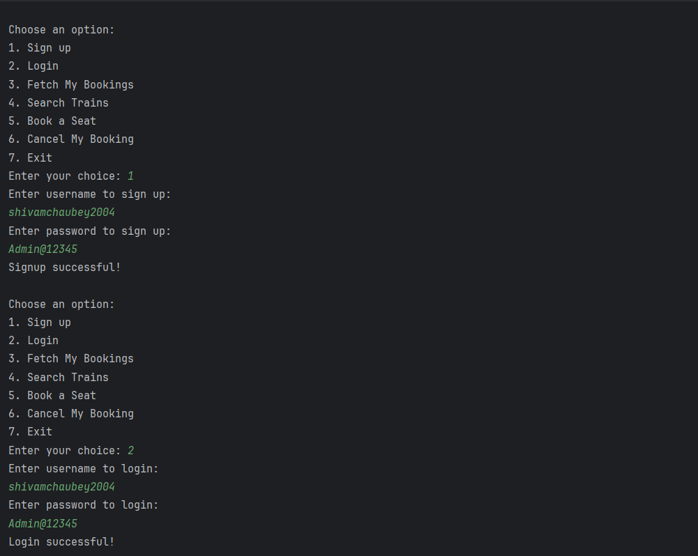
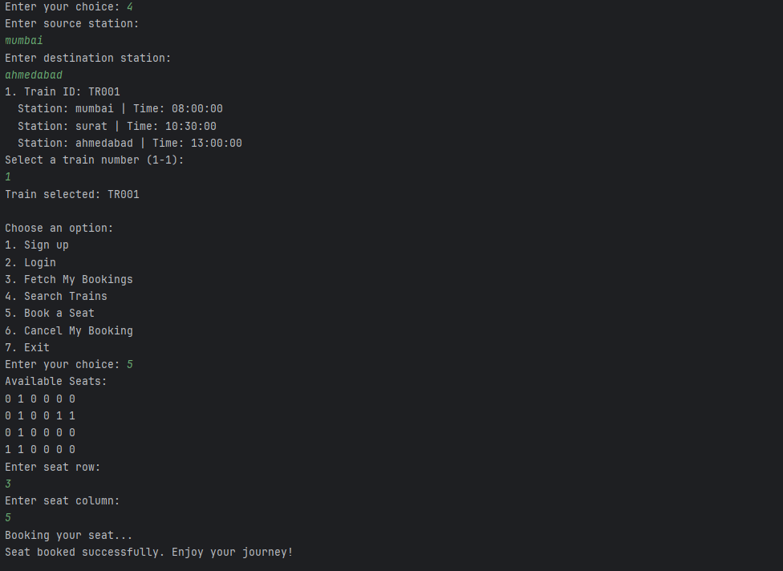
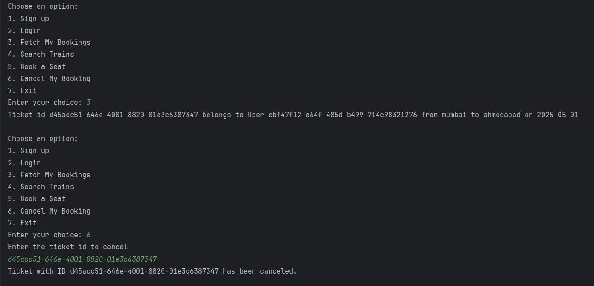
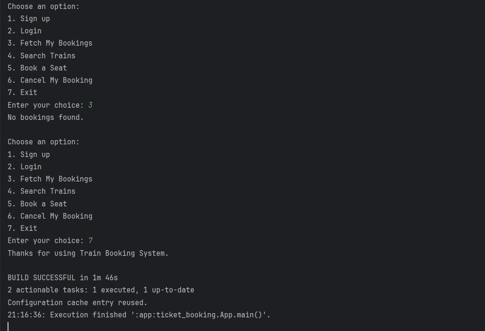

# Java Train Booking System

This is a console-based **train booking system** made in Java from scratch. I started building this project while learning Java itself so this app became my way of learning the language, exploring concepts like object-oriented programming, file handling, and basic service structures.

---

## How It Started

I started with just one idea: can I build a working train booking app without any database, using only Java?

At first, I didn't know how to structure things. Slowly, I began learning:

- how to organize code into services and entities
- how to read/write JSON files using Jackson
- how to hash passwords securely using BCrypt
- how to manage data like trains, seats, users, and tickets through logic

While building this, I not only understood **Java syntax**, but also **real-world application flow**  signup, login, storing state, and reading/updating files.

---

## Features Implemented

- User Signup with password hashing
- User Login and validation
- Train search by source and destination
- Seat selection using 2D seat matrix
- Ticket booking with train, date, source/destination
- Fetching booked tickets per user
- Cancel ticket by ID
- All data stored in local JSON files (no DB used)

---

## Tech Stack

- **Java 20**
- **Gradle** (build tool)
- **Jackson** (for JSON parsing)
- **BCrypt** (for password hashing)
- **Local storage** using `users.json` and `trains.json`

---

## Folder Structure

```
ticket_booking/
├── Entities/         User, Ticket, Train
├── Services/         Business logic for train & booking
├── localDb/          All data stored here in JSON files
├── util/             Password hashing utility
└── App.java          Main entry point for the system
```

---

## How to Run

1. Make sure Java 20 is installed  
2. Open terminal and run:
```bash
./gradlew run
```

---

## 📸 Screenshots

### 1. Signup and Login


### 2. Search Train and Book a Seat


### 3. Fetch Bookings and Cancel


### 4. Final Output


---

## What I Learned

> **Low level design is the most important part of a project.**  
> While building this, I realized that how you **structure** your classes, services, and data flow matters way more than just writing logic that "works".

This one project helped me understand:

- Java objects and class-based structure
- File I/O and persistence without a DB
- Writing modular code using services
- Cleanly separating UI logic and backend logic
- Using external libraries with Gradle


---

## Final Note

This was my first full project in Java and I'm proud of it. It's not perfect, but it works end-to-end. Now that the system is finally working, I understand both **Java syntax** and **how to build real applications**.

```
